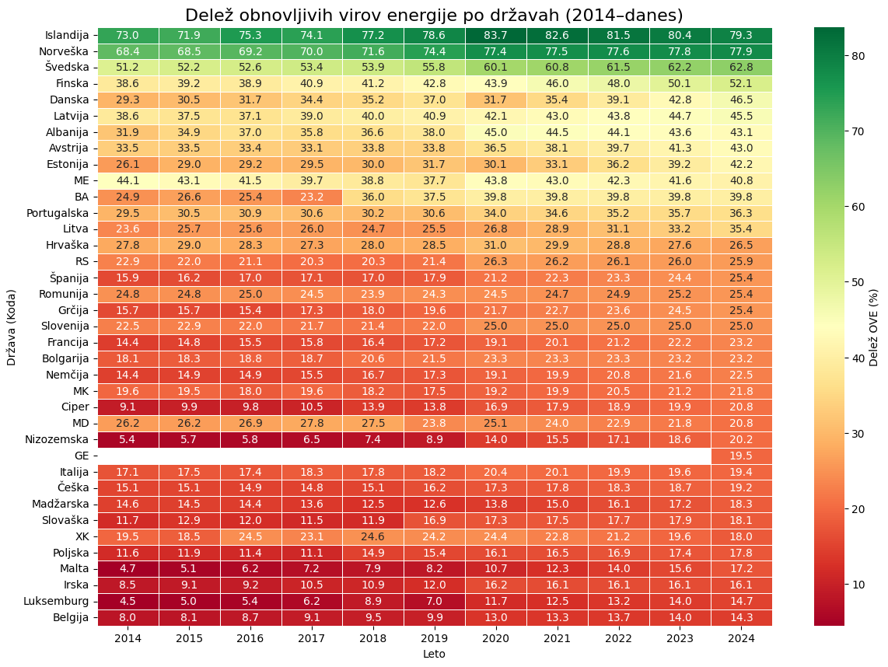
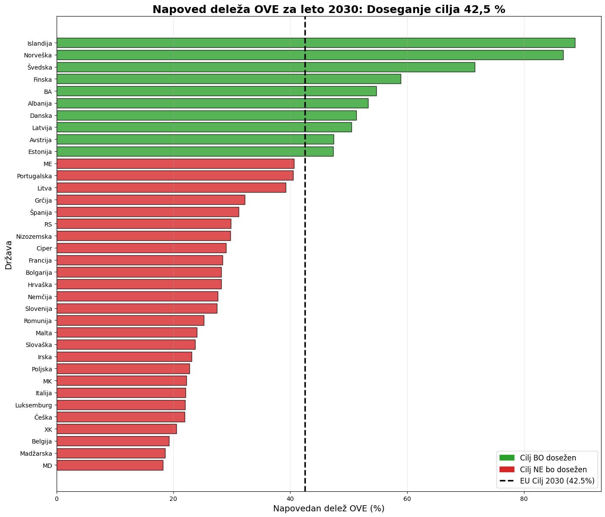
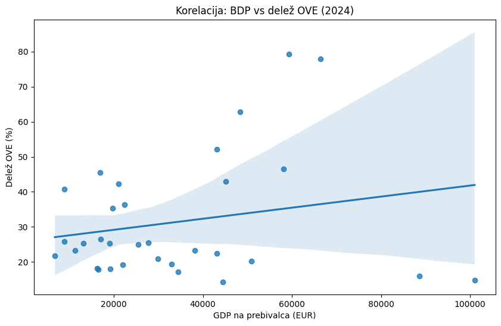

# Napoved rasti obnovljivih virov energije v Evropi

Filip Mally, Žiga Novak, Matevž Skvarč, Mark Šincek, Simon Korošec

# 1. Opis problema
glavni cilj raziskave je analizirati rast deleža obnovljivih virov energije v državah EU in širše preveriti, kako gre državam pri uresničevanju cilja 42.5% do leta 2030.
Problem ki ga preučujemo je neenakomerna hitrost energetske rasti med državami, kar otežuje enotno načrtovanje evropske podnebne politike.

# 2. podatki
Uporabljamo uradne podatke statističnega urada Eurostat. Glavni podatki vključujejo:
 - estat_nrg_ind_ren: delež OVE v končni porabi energije
 - estat_nrg_bal_s: energetske bilance
 - estat_nrg_cb_rw: specifični viri obnovljive energije
 - sdg_08_10_tabular: podatki o GDP za države

 Podatki so bili v surovi obliki nepregledni, zato smo zgradili pomožno knjižnico data_utils.py, ki avtomatizira čiščenje (odstranjevanje enot, pretvorba v numerične tipe) in preslikavo kratic držav v slovenska imena.
 Pri tabeli sdg_08_10_tabular smo morali pridobiti samo nam ključne podatke saj Eurostat hrani noter veliko različnih tipov podatkov za posamezne države, za to smo morali filtrirati value > 1000.

 # 3. Izvedene analize
 Do te faze smo preučili:
 1. filtriranje in transformacija 
 Iz nabora podatkov smo izluščili podatke od leta 2014 naprej in ustvarili pivotno tabelo za primerjavo med državami
 2. Vizualizacijo z toplotnim zemljevidom
 Z uporabo knjižnice Seaborn smo prikazali intenzivnosti prehoda na OVE po letih.
 3. Linearna regresija
 Za vsako državo posebej smo zgradili model linearne regresije, ki na podlagi trenda zadnjih 10 let napoveduje vrednost za 2030
 4. primerjava s cilji
 Rezultate napovedi smo kategorizirali glede na to ali država doseže prag 42.5% ali ne

 # 4. glavne ugotovitve in rezultati
 Razlike med posameznimi državami so zelo opazne, sploh med severnim in južnim delom evrope.
 - Vodilne države ki že sedaj presegajo cilje so Skandinavske države. Na toplotnem zemljevidu lahko opazimo, da so te države konsistentno v zelenem območju skozi celotno desetletje.

    vizualizacija 1:
    Toplotni zemljevid deleža OVE(2014-danes) prikazuje stabilo rast v večini držav
    
- Napoved za 2030 ni pretirano obetavna, saj precejšen del držav Eu s trenutim tempom rasti ne bo dosegel cilja 42.5%.
- zanimivo opažanje pri podatkih je to, da imajo nekatere države srednje evrope višji naklon rasti kot nekatere razvitejše države.
    Vizualizacija 2:
    Na paličnem grafikonu lahko vidimo napoved, katere države bodo do leta 2030 uresničile svoj cilj 42.5% deleža obnovljivih energij
    

- Analiza ekonomskega vpliva (GDP vs OVE)
Želeli smo analizirati kako vpliva GDP na hitrost rasti OVE, za kar smo uporabili Pearsonov koeificient. Ta je po naših ugotovitvah znašal 0.21, kar pomeni da GDP na prebivalca in OVE nista pretirano močno povezani in bi se ju lahko ignoriralo.
Prav tako lahko razberemo, da države ki so že na 30-40% OVE lažje dosegajo cilje, saj že imajo nekaj infrastrukture in se tako lažje razvijajo
Države z nizkim GDP vćasih hitreje rastejo ker lahko investirajo v nove tehnologije medtem ko so bogatejše pogosto že zapletene s staro infrastrukturo.

    Vizualizacija 3:
    prikaz korelacije OVE z GDP
    

# 5. izvorna koda za analizo
Vse analize so izvedene v datoteki `analysis.ipynb`. Ključni deli kode vključujejo:
- `clean_eurostat_df`: funkcija za procesiranje surovih podatkov
- `LinearRegression().fit(X,y)`: modeliranje rasti
-Vizualizacijski del, ki uporablja matplotlib in patches za grafični prikaz doseganja ciljev

